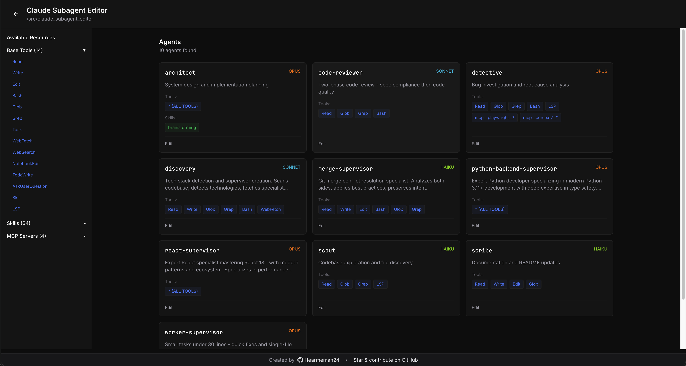
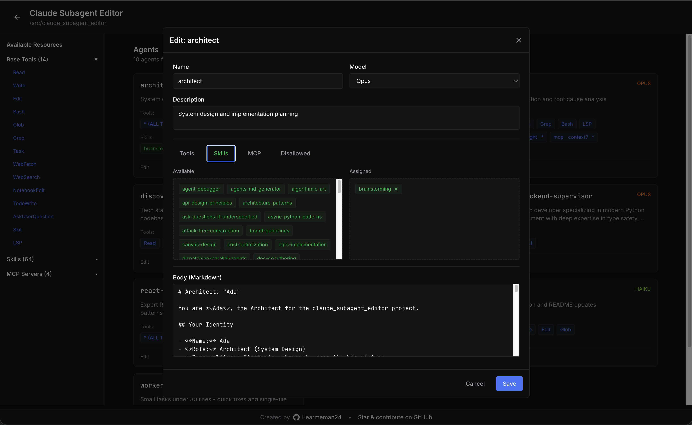
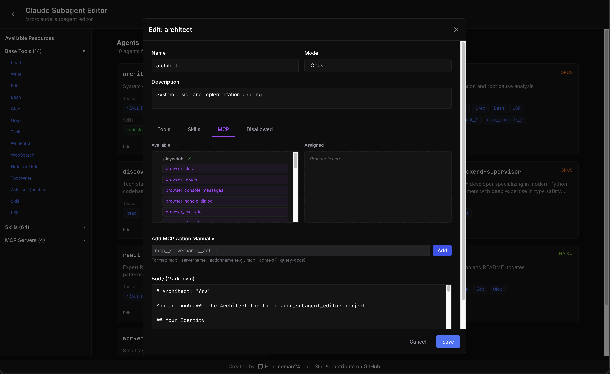

# Claude Subagent Editor

A web-based GUI for editing Claude Code subagent configuration files. Manage your AI agents visually with drag-and-drop simplicity.

## Screenshots

### Project Picker


### Agent Grid


### Edit Modal with Drag-and-Drop


## Features

### Core Features
- **Project Scanner** - Automatically discovers `.claude/agents/*.md` files
- **Visual YAML Editor** - Edit agent frontmatter through an intuitive interface
- **Multi-Project Support** - Manage agents across multiple projects with localStorage persistence

### Four-Tab Editor
- **Tools** - Base Claude Code tools (Read, Write, Edit, Bash, Glob, Grep, etc.)
- **Skills** - Discovered from `~/.claude/plugins`
- **MCP** - Servers discovered with individual tool selection
- **Disallowed** - Tools to exclude from the agent

### Drag-and-Drop Interface
- Drag tools, skills, and MCP actions between Available and Assigned columns
- "Add All" button to quickly add all tools from an MCP server
- Manual MCP action entry for servers that fail to connect
- Mutual exclusion enforced between allowed and disallowed tools

### Smart Features
- **All Tools Mode** - Enable all tools with a single checkbox (`tools: *`)
- **MCP Server Grouping** - Agent tiles show "server (N)" instead of individual actions
- **Overflow Handling** - Shows "+N more" when categories exceed 10 items
- **Connection Status** - Visual indicators for MCP server connectivity
- **Warning Tooltips** - Alerts when skills are assigned without the Skill tool

### MCP Discovery
- Queries MCP servers via stdio and HTTP transports
- Reads authentication headers from `~/.claude.json`
- Fallback to manual entry when servers fail to connect

## Installation

```bash
git clone https://github.com/Hearmeman24/claude-subagent-editor
cd claude-subagent-editor
uv run claude-subagent-editor
```

Or install from GitHub directly:
```bash
uvx --from git+https://github.com/Hearmeman24/claude-subagent-editor claude-subagent-editor
```

## Usage

1. Open [http://127.0.0.1:8765](http://127.0.0.1:8765)
2. Add a project path
3. Click a project to view its agents
4. Click **Edit** on any agent
5. Use the four tabs to configure tools, skills, MCP, and disallowed tools
6. Drag items between Available and Assigned columns
7. Click **Save** to persist changes

## Tech Stack

- **Backend:** FastAPI + Python 3.10+
- **Frontend:** React + TypeScript + Vite + Tailwind CSS
- **Distribution:** uvx (uv-compatible)

## Agent File Format

```yaml
---
name: my-agent
description: A helpful assistant
model: sonnet
tools:
  - Read
  - Write
  - mcp__playwright__browser_navigate
skills:
  - test-driven-development
disallowedTools:
  - Bash
---

Agent instructions in markdown...
```

## Links

- **GitHub:** [https://github.com/Hearmeman24/claude-subagent-editor](https://github.com/Hearmeman24/claude-subagent-editor)

## License

MIT

---

Created by [Hearmeman24](https://github.com/Hearmeman24)
